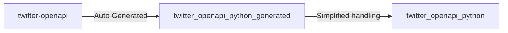

# twitter_openapi_python

Typed Twitter scrapers by Pydantic.

[issues](https://github.com/fa0311/twitter_openapi_python/issues) / [discussions](https://github.com/fa0311/twitter-openapi/discussions)

## Table of Contents

This repository contains two packages.

- [twitter_openapi_python](./twitter_openapi_python) Package for human-friendly Python
- [twitter_openapi_python_generated](./twitter_openapi_python_generated) Python package automatically generated from [twitter-openapi](https://github.com/fa0311/twitter-openapi) by OpenAPI generator

---

## twitter_openapi_python

Learn more about people-friendly Python packages here.

[twitter_openapi_python/README.md](./twitter_openapi_python/README.md)

## twitter_openapi_python_generated

Learn more about the automatically generated Python package here.

[README-generated.md](README-generated.md)

## License

This project is dual licensed. You can choose one of the following licenses:

- [Custom License](./LICENSE)
- [GNU Affero General Public License v3.0](./LICENSE.AGPL)
