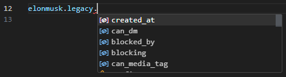

# twitter_openapi_python

Twitter scraping with data validation by pydantic.



## Setup

```shell
pip install twitter-openapi-python
```

## Usage

```python
import json
import datetime

from pathlib import Path
from tweepy_authlib import CookieSessionUserHandler
from twitter_openapi_python import TwitterOpenapiPython

# login by tweepy_authlib
if Path("cookie.json").exists():
    with open("cookie.json", "r") as f:
        cookies_dict = json.load(f)
        if isinstance(cookies_dict, list):
            cookies_dict = {k["name"]: k["value"] for k in cookies_dict}
else:
    auth_handler = CookieSessionUserHandler(
        screen_name=input("screen_name: "),
        password=input("password: "),
    )
    cookies_dict = auth_handler.get_cookies().get_dict()

# To extract cookies from Windows (Linux by default)
# If you use tweepy_authlib, you must be on Windows
client = TwitterOpenapiPython()
client.additional_api_headers = {
    "sec-ch-ua-platform": '"Windows"',
}
client.additional_browser_headers = {
    "sec-ch-ua-platform": '"Windows"',
}

# get client from cookies
𝕏 = client.get_client_from_cookies(cookies=cookies_dict)

# tweet "Hello World!!" with current time
time = datetime.datetime.now().strftime("%Y-%m-%dT%H:%M:%SZ")
𝕏.get_post_api().post_create_tweet(tweet_text=f"Hello World!!{time}")

# get user info
response = 𝕏.get_user_api().get_user_by_screen_name("elonmusk")
```

### Login

```python
from twitter_openapi_python import TwitterOpenapiPython

# guest client
𝕏 = TwitterOpenapiPython().get_guest_client()
tweet = 𝕏.get_default_api().get_tweet_result_by_rest_id("1349129669258448897")
assert tweet.data is not None
assert tweet.data.tweet.legacy is not None
print(tweet.data.tweet.legacy.full_text)
```

### Multiple OS

The Token can only be used on the same OS that issued the Token
In other words, if the sec-ch-ua-platform does not match, the Token cannot be used.
This library uses the Linux Chrome header by default.
To use Token issued by Windows, do the following.

```python
client = TwitterOpenapiPython()
client.additional_api_headers = {
  "sec-ch-ua-platform": '"Windows"',
};
```

## License

This project is dual licensed. You can choose one of the following licenses:

- [Custom License](./LICENSE)
- [GNU Affero General Public License v3.0](./LICENSE.AGPL)
